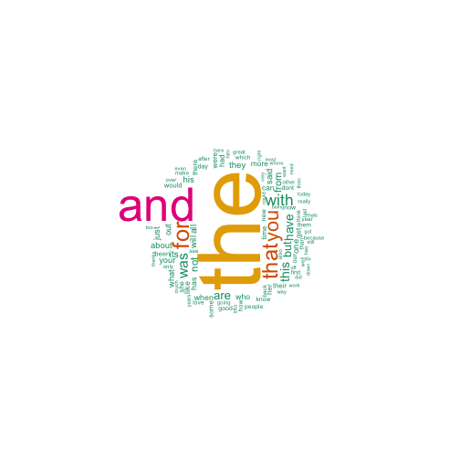
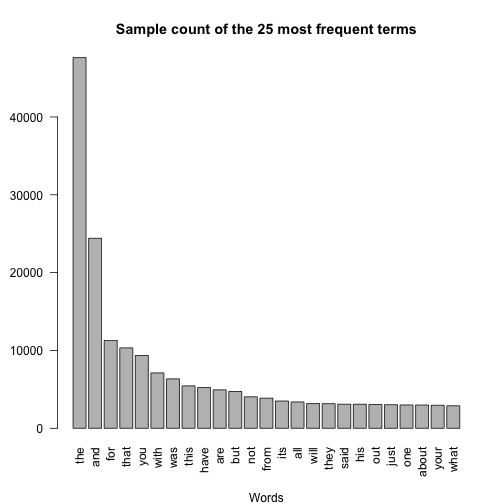

# Introduction
This project is an investigation into using Data Science in the area of Natual Language Processing and Text Mining

Natural language processing (NLP) is a field of computer science, artificial intelligence, and linguistics concerned with the interactions between computers and human (natural) languages. As such, NLP is related to the area of human–computer interaction. Many challenges in NLP involve natural language understanding, that is, enabling computers to derive meaning from human or natural language input, and others involve natural language generation. Wikipedia

Text Mining refers to the process of deriving high-quality information from text. High-quality information is typically derived through the devising of patterns and trends through means such as statistical pattern learning. 
Text mining usually involves the process of structuring the input text (usually parsing, along with the addition of some derived linguistic features and the removal of others. Ref. (Wikipedia: https://en.wikipedia.org/wiki/Text_mining)

The goal of this project is just to display that you've gotten used to working with the data and that you are on track to create your prediction algorithm.

The motivation for this project is to: 

1. Demonstrate that you've downloaded the data and have successfully loaded it in.
2. Create a basic report of summary statistics about the data sets.
3. Report any interesting findings that you amassed so far.
4. Get feedback on your plans for creating a prediction algorithm and Shiny app. 

# Data Acquisition
Sample text files were provided by SwiftKey in English, German, and Finnish, and Russion
We will only deal with English version of the supplied data files

 * Download the data from "https://d396qusza40orc.cloudfront.net/dsscapstone/dataset/Coursera-SwiftKey.zip"
 * Import into RStudio
 * Sample the data
 * Tokenize
 * Profanity Filtering


# Data Loading
After testing for the encoding of the supplied files the data was downloaded using the base package "readLines" function for each of the three types oftext files; news items, blog entries, and twitter feeds. 

            

```r
# load('/Users/williammcdonald/CourseraCapstoneData/twitter.RData')
# load('/Users/williammcdonald/CourseraCapstoneData/news.RData')
# load('/Users/williammcdonald/CourseraCapstoneData/blogs.RData')
# Include Profanity file
# naughty <- readLines("/Users/williammcdonald/CourseraCapstoneData/swearWords.txt", skipNul = TRUE)
# CLose connections
# closeAllConnections()
```

From there we can proceed to determine some basic statistics of the data sets such as Overall file size, number of lines of text, minimum, maximum, and average characters or distinct words per line as well as the number of unique words in each file individually. 


Basic summary file information before clean up .

```r
library(knitr)
kable(df)
```


|Corpus     | Size (Mb)| Total # of Lines| Mean Characters per Line| Total Words| Total Unique Words|
|:----------|---------:|----------------:|------------------------:|-----------:|------------------:|
|Twitter.EN |     301.4|          2360148|                    68.68|    36790814|             481068|
|News.EN    |     249.6|          1010242|                   201.16|    34866445|             277667|
|Blogs.EN   |    1674.5|           899288|                   229.99|    37566572|             369209|

# Sampling
Based on the initial exploration, the files are between .9  and 2.4 million lines with a maximum number of charaacters per line between 140 (twitter) and 40,000 (blogs). Based on the size of the files, number of lines, and the number of words, analysis of the entire data set will be handled by sampling and statistical inference for faster processing. 

## Sampling the Data Sets Individually
We'll start initial sampling at approximately 1% of the respective  number of lines. This runs teh risk of under representing the number of Twitter words in favor of the other two texts and further exploration might be necessary to determine if having separate prediction engines for Tweets vs. News items vs. Blog entries. For initial exploration, however, I beieve this will be an adequate start.


```r
# twit.smpl <- sample(twitter, size = 20000)
# news.smpl <- sample(news, size = 10000)
# blog.smpl <- sample(blogs, size = 10000)
```


# Tokenization
Tokenization involves the process of cleaning the texts of the following information:

1. Replace Profanity with \"!@$%\"
2. Remove Punctuation
3. Remove any unicode characters 
4. Remove Numbers
5. Convert all to lowercase
6. Stripping any extra whiespace

In order to regularize the cleanup, a short function was created to clean the sampled texts in a uniform manner. 
Additional libraries were also imported to complete the cleanup and display the results.


```r
library(tm)
library(RWeka)
library(SnowballC)
library(wordcloud)
library(slam)
library(ggplot)
```

```
## Error in library(ggplot): there is no package called 'ggplot'
```

```r
source("/Users/williammcdonald/Coursera-JHU-Capstone/Capstone_helper.R")
hashtags <- "#[0-9][a-z][A-Z]+"
special <- c("®","™", "¥", "£", "¢", "€", "#","_")
unicode <- "[^[:print:]]"

# Function to clean and vectorize text files
cleanText <- function(text){
        # remove all hashtags, substitute for profanity, remove special characters 
        x <- gsub(unicode, " ", text)
        x <- gsub(hashtags, " ", x)
        x <- gsub(paste0('\\<', naughty , '\\>', collapse = '|'), '!$?%', x)
        x <- gsub(paste0(special, collapse = '|'), " ", x) 
        x <- tolower(x)
        # x <- stripWhitespace(x)
        x <- removePunctuation(x, preserve_intra_word_dashes = TRUE)
        x <= removeNumbers(x)
        # x <- strsplit(x, "\\W")
        return(x)
}
```

# Vectorization and creating a Corpus.
The samples were then combined into a single text file and then vectorized using the tm VectorCorpus function before further manipulation.


```r
sampleText <- c(twitter.smpl, news.smpl, blogs.smpl)

# text.sample <- cleanText(sampleText)
sample.corp <- VCorpus(VectorSource(sampleText))
# text.corp2 <- data.frame(text=unlist(sapply(text.sample, `[`, "content")), stringsAsFactors=F)
```


# Word Frequencies
A wordcloud of the most frequent terms was created for a quick visual study of the landscape of top occuring words.


```r
par(mar = c(1,1,1,1))
wordcloud(sample.corp, scale=c(8,0.3), 
          min.freq=5, max.words=100, random.order=FALSE,
          rot.per=0.5, use.r.layout=FALSE,
          colors=brewer.pal(6, "Dark2"))
```

 

# Term Document Matrix. 
Using the tm package Term Doocument Matrix functionality, we can create a matrix of all the terms in the sample corpus. As a matrix and using the row_sums function in the R slam package, we can get sums of the various terms in the matrix. Sorting in descending order will show us the most freqently used terms in the sample.


```r
text.tdm <- TermDocumentMatrix(sample.corp)
text.freq <- sort(row_sums(text.tdm),decreasing=TRUE)
```

Creating a barplot of the 25 most frequent terms shows that many of them are "stop" words.


```r
par(mar = c(5,4,4,2), mgp = c(4,1,0) )
barplot(text.freq[1:25], main = "Sample count of the 25 most frequent terms", ylab = "Frequency", xlab = "Words", las = 2)
```

 


# n-Grams
Using the RWeka package, we will attempt to find the most frequently used combinations of 2 and 3 words as a predecessor to a predictive model.


## Bigram model


